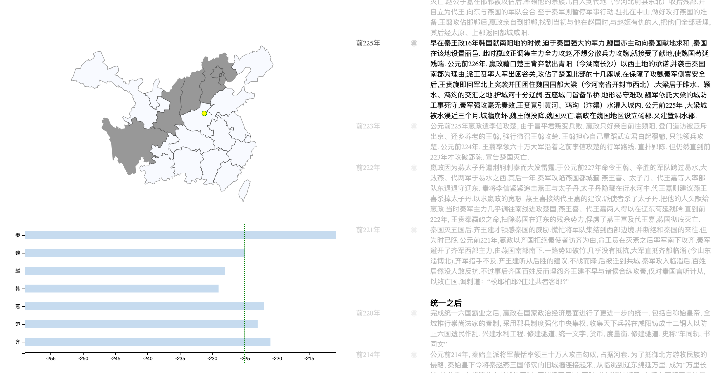

# 秦始皇生平可视化报告

## 简介

本次可视化工作(pku数据可视化课程作业)实现了对秦始皇嬴政的生平的可视化. 核心内容在于秦灭六国完成统一, 当然也包含了嬴政
早年成为秦王巩固秦内统治和统一之后所做的事情这些数据. 用户能够直观看到嬴政的生平中重大事件的地理
位置随时间的变迁, 灭六国的战略方针和进军步伐. 此外我们还实现了一个能够更直观看到时间变迁的条形图,
以对比战国七雄的存在时间.

## 数据分析

本次可视化选择的是秦始皇生平, 使用的数据自然也只有古籍以及后人整理. 我们主要从wiki的秦始皇词条获取主干信息, 对于事件细节则细致查阅子词条和引用文献加以对照和整理.

可视化的数据结构为: 每个时间点(时间)的特征地点(坐标), 以及事件的细节(文本数据). 由于我们不会对文本数据进行进一步的分析, 因此可视化为三维数据. 在灭六国阶段我们额外拥有地理范围是否属于秦这样的额外数据维度. 可视化系统的核心需求在于展示坐标以及秦疆域随时间的变迁, 而文本数据则放置在阅读框内供读者查阅.

## 设计细节

在设计可视化系统之初, 就明确了生平可视化应当给出一个时间轴的实现来展示其他特性随着时间变化的不同取值. 这里我们也是这样实现的. 最大的困难在于如何展示地理位置数据, 仅通过坐标将会很难给人以直观感受. 因此我采用了中国地图(事实上是战国时期被七雄控制的部分地图)以及寻找到古时地点的当今位置坐标来完成地理位置可视化. 但由于时间久远, 难以确定确切的七国政治边界, 因此只能简要画出. 但依然拥有相当好的数据展示能力.

## 可视化系统结果

我们的可视化系统的主视图为:

对于当前锚点的文本我们是用了高亮显示来让用户快速定位当前位置, 左上地图上的黑色区域(由于秦尚黑因此设计)指示了秦的疆域, 一个黄点确定了特征位置, 左下条形图展示了六国的寿命, 横轴为时间点. 一个虚线指示了当前时间位置. 交互上采用文本区域的滚动事件来触发, 滚动时左侧两个试图将会根据高亮位置的时间信息来更新行为. 但由于时间离散而且跨度相当不均匀, 左侧时间轴并没有反过来影响文本框的能力.

完成这个工程之后, 最大的感受在于地图可视化对于展示坐标数据的强大展示能力. 往常统一六国进程只通过行军箭头来看, 远远没有这种随着时间变迁秦疆域的变化来的直观和震撼. 从展示秦始皇功绩这一点来看这个可视化是成功的. 但它仍然有更进一步的发展空间. 比如将史料信息完整的嵌入到可视化系统中, 如果可以获取具体的行军数据在地图上更细致地展示秦军的运动过程等等. 将在今后完成这些更进一步完善的优化.

`./ref` 文件夹下是可视化f19班上另一个同学mx的作品, 非常感谢给了我很大启发.
